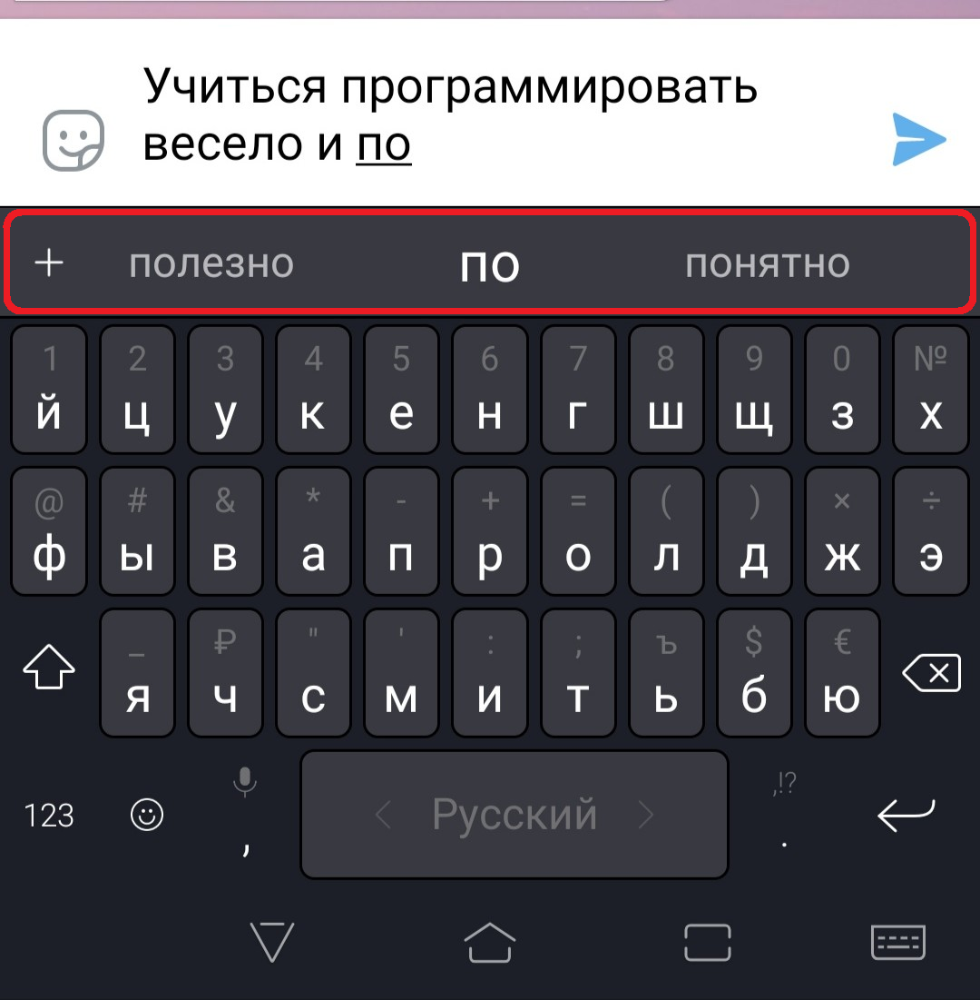
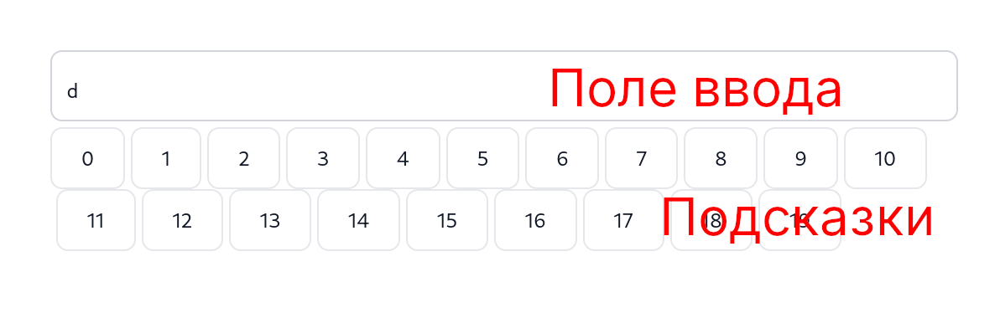

## Контрольное задание 1

Ваша задача, реализовать сервис для помощи набора текстового сообщения.

Чтобы стало понятнее, вот что требуется выполнить.


В рамках задания требуется реализовать сам алгоритм по подбору кандидатов слов, которыми можно продолжить фразу.

Для демонстрации работы вашего алгоритма, в репозитории есть простой графический интерфейс,
который состоит из поля ввода текста и не более 10 подсказок. Текст подсказок соответсвует кандидатам, которые возвращает ваш алгоритм.

### How to start

Для начала склонируйте репозиторий со всеми зависимостями. Для этого выполните в командной строке
```shell script
git clone https://github.com/drewxa/keyboard-suggest.git homework
cd homework
git submodule update --init --recursive
```


### Тестовый запуск
Скомпилируйте тестовый проект:
```shell script
cmake -B _builds -H . -DBUILD_SSL=NO
cmake --build _builds --target app
```

Запустить приложение:
```shell script
./_builds/app -r ./misc/viewer/
```

В консоли вы увидите адрес, по которому можно перейти, например, 
 http://localhost:1984/viewer/index.html. Это и есть интерфейс программы.
 
Остановить приложение можно нажав на **Ctrl+C**.



### Как все устроено
На каждое изменение поля ввода, вызывается функция `MakeSuggestions`. Протитип функии можно увидеть ниже:

```c++
Answer MakeSuggestions(const Input &input, const Storage &storage, const InternalState &old_state, InternalState &new_state);
```

Функция должна вернуть объект типа `Answer`.
```cpp
struct Answer {
  std::vector<std::string> suggestions;
};
```

Поле `suggestions` содержит текст подсказок. Первые 10 подсказок отобразятся в интерфейсе.
Если массив `suggestions` содержит меньше 10 подсказок, то отобразится весь массив.

Функция `MakeSuggestions` должна вычислить подходящие подсказки на основе входных аргументов.

Агрумент `input`, содержит два поля:
* `input` - текст, который хранит все содержимое поля ввода
* `last_word` - содержит последнее набранное слово

```cpp
struct Input {
  std::string input;
  std::string last_word;
};
```

Аргумент `storage` хранит служебную информацию для работы вашего алгоритма. Объект `storage` инициализируется один раз во время старта программы.
Для инициализации `storage` используется фунция `InitStorage`.

В аргумент `new_state` можно сохранить служебную информацию, которая понадобится во время следующего запуска фукнции `MakeSuggestions`.
В структуру `InternalState` можно добавлять поля, которые вам необходимы. Для этого надо изменить структуру `InternalState` в файле [state.h](include/state.h).

Аргумент `old_state` хранить служебную информацию с предыдущего запуска фукнции `MakeSuggestions`. Если фунция `MakeSuggestions`, то `old_state` хранит проинициализированные значения, которые получились в фукнции `InitState`.

### Покажите код
Весь код программы можно представить следующим кодом:
```cpp
Config config; // задается через командную строку

InternalState old_state;
InitState(config, old_state);

Storage storage;
InitStorage(config, storage);

while (true) {
    Input input = GetNewInput(); // получаем информацию
    InternalState new_state;
    auto answer = MakeSuggestions(input, storage, old_state, new_state);
    old_state = new_state;
    SendToGUI(answer); // отображаем подсказки
}
```

### Как управлять подсказками

Таким образом, вам требудется реализовать три фунции:
* `InitStorage`
* `InitState`
* `MakeSuggestions`

И изменить две структуры, если вам это требуется:
* `Storage`
* `InternalState`

### Как реализовать алгоритм
Как вам только пожелается! это творческая задача, тут нет единсвенно правильного решения. Все работающие решения правильные.

Но если вы не знаете как подступиться, то вот один из вариантов.

Вот [тут](https://dumps.wikimedia.org/simplewiki/latest/simplewiki-latest-pages-articles.xml.bz2) можно скачать архив, который содержит тексты из википедии. Всю википедию можно скачать [тут](https://meta.wikimedia.org/wiki/Data_dump_torrents#English_Wikipedia), но для данной задачи это не является необходимостью.

Используйте этот файл, чтобы составить статистику:
сколько раз слово **B** предшествовало слову **A** для каждой пары слов **A** и **B**.

Используя это знание, вы сможете подсказывать самые частотные слова, которые идут после введенного слова.

